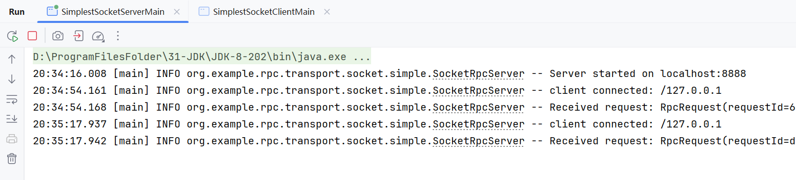
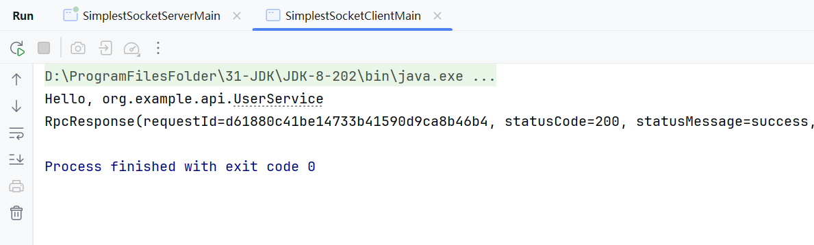

    <h1>🚀 Tiny-RPC</h1>
    

        <b>基于 Netty + Zookeeper + Spring 的高性能分布式 RPC 框架</b>
    

    

        
        
        
        
        
        
    

---

## 项目介绍

## 架构设计

## 效果展示

## 性能测试

